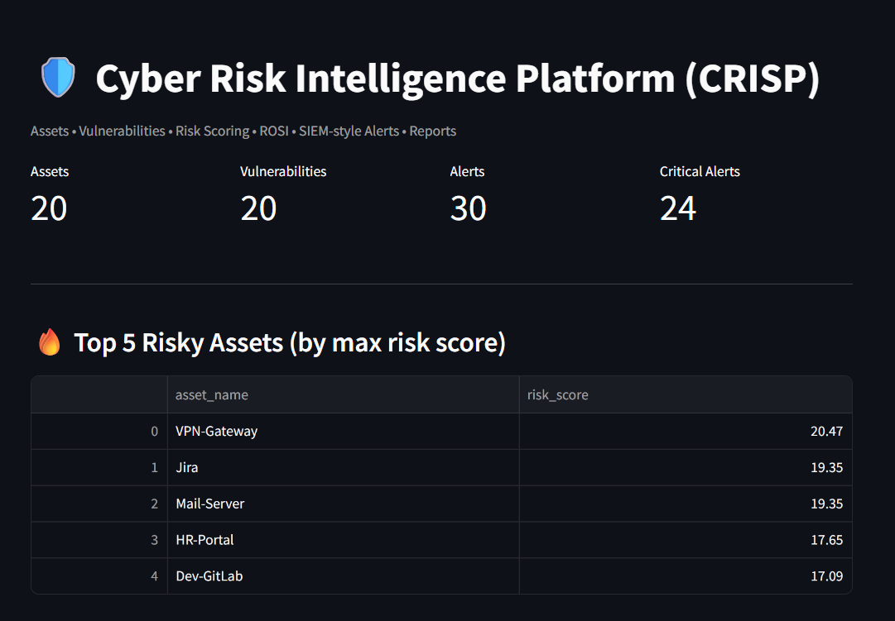
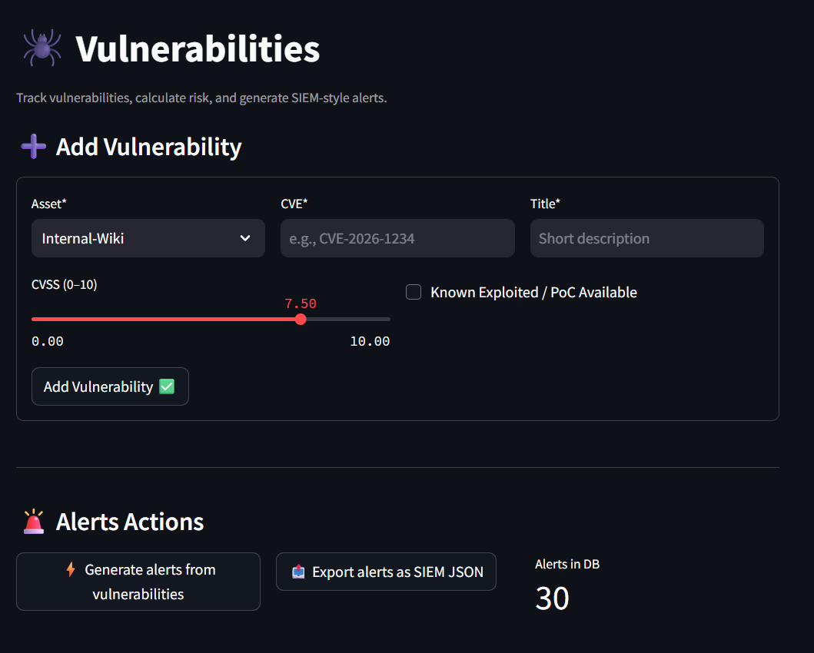
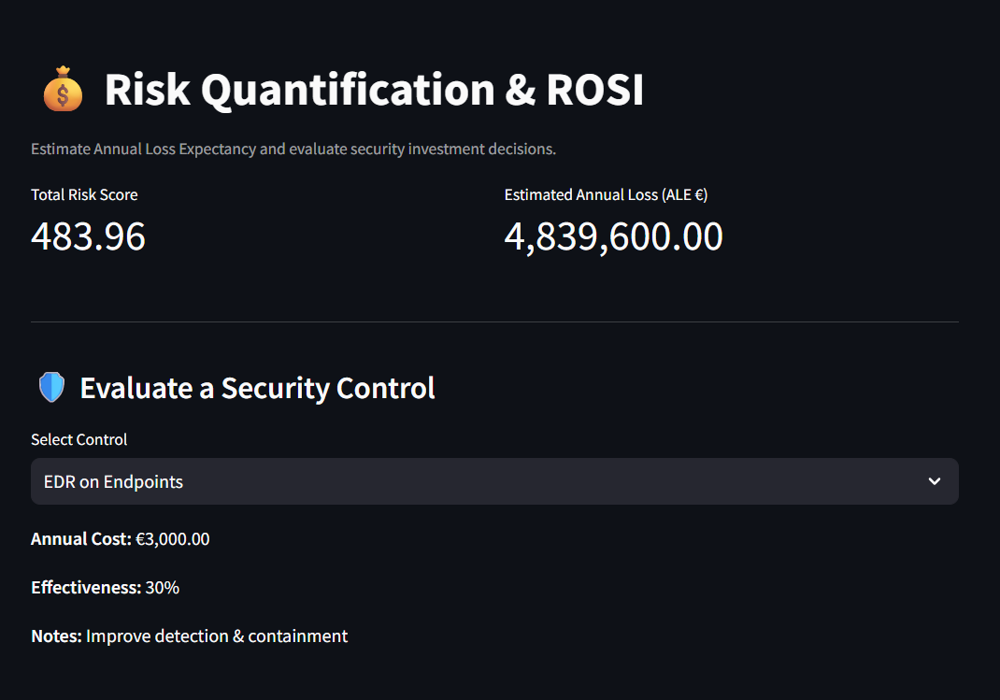
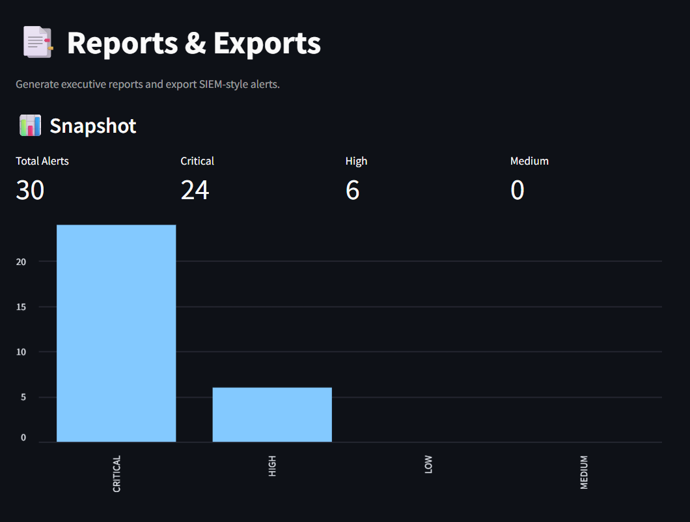

# 🛡️ Cyber Risk Intelligence Platform (CRISP)

---
## 🌐 Live Demo
🚀 https://cyber-risk-intelligence-platform-mlky9pki99u9yoytdalhdp.streamlit.app/
[](https://cyber-risk-intelligence-platform-mlky9pki99u9yoytdalhdp.streamlit.app/)
---

Enterprise-style Cyber Risk Intelligence Platform built with **Python +
Streamlit**.

CRISP simulates a real-world cyber risk environment including:

-   Asset inventory management
-   Vulnerability tracking
-   Dynamic risk scoring engine
-   Automated alert generation (SIEM-style JSON export)
-   Risk quantification (ALE)
-   ROSI (Return on Security Investment) modeling
-   Executive HTML reporting with preview & download

------------------------------------------------------------------------

## 🚀 Live Architecture Overview

CRISP follows a modular architecture:

    app/                → Streamlit UI pages
    core/               → Business logic (risk, ROSI, reporting)
    data/               → SQLite database + seed data
    exports/            → Generated alerts & reports

------------------------------------------------------------------------

# 📸 Screenshots (Add These)

After deployment, add screenshots to the `/assets/` folder and update
paths below.

### 1️⃣ Home Dashboard



------------------------------------------------------------------------

### 2️⃣ Vulnerabilities Page



------------------------------------------------------------------------

### 3️⃣ Risk & ROSI Page



------------------------------------------------------------------------

### 4️⃣ Reports Page



------------------------------------------------------------------------

# ⚙️ Features

## 🗂️ Asset Inventory

-   Add assets manually
-   CSV import
-   Filter by owner, type, exposure
-   Criticality scoring (1--5)
-   Internet exposure flag

## 🕷️ Vulnerability Management

-   Add CVE manually
-   CVSS scoring
-   Known exploited toggle
-   Dynamic risk calculation
-   Filter by severity, exploited status
-   Auto alert generation

## 🚨 Alert Engine

-   Converts vulnerabilities → risk alerts
-   Severity levels: LOW, MEDIUM, HIGH, CRITICAL
-   Export to JSON (SIEM-style)

## 💰 Risk Quantification

-   Total risk score aggregation
-   Annual Loss Expectancy (ALE) estimation
-   Visual risk distribution charts

## 🛡️ ROSI Modeling

-   Evaluate security controls (MFA, Patch Mgmt, WAF, etc.)
-   Estimate risk reduction value
-   Calculate Return on Security Investment
-   Visual ALE before/after comparison

## 📑 Reporting

-   Executive HTML report generation
-   Severity summary
-   Top 10 risks
-   Control recommendation
-   Downloadable HTML preview

------------------------------------------------------------------------

# 🧠 Risk Model (Simplified)

Risk Score =

    (CVSS × Criticality Factor × Exposure Factor) + Exploit Bonus

ALE estimation:

    ALE = Total Risk Score × €10,000 (demo multiplier)

ROSI formula:

    ROSI = (Risk Reduction Value - Control Cost) / Control Cost

------------------------------------------------------------------------

# 🛠️ Installation

Clone the repository:

``` bash
git clone https://github.com/laugerr/cyber-risk-intelligence-platform.git
cd cyber-risk-intelligence-platform
```

Create virtual environment:

``` bash
python3 -m venv .venv
source .venv/bin/activate   # Linux / Mac
# or
.venv\Scripts\Activate.ps1   # Windows
```

Install dependencies:

``` bash
pip install -r requirements.txt
```

Run the app:

``` bash
streamlit run app/Home.py
```

------------------------------------------------------------------------

# 📦 Tech Stack

-   Python 3
-   Streamlit
-   SQLite
-   Pandas
-   Pydantic

------------------------------------------------------------------------

# 📈 Future Improvements

-   CVE API integration (NVD)
-   Authentication & RBAC
-   Multi-tenant support
-   Plotly interactive dashboards
-   PDF report export
-   Cloud deployment (Render / Streamlit Cloud)
-   Dark mode theme

------------------------------------------------------------------------

# 🎯 Purpose

This project demonstrates:

-   Cyber risk quantification
-   Application security modeling
-   Business-aligned security investment decisions
-   Secure software architecture principles

Designed as a portfolio project aligned with MSc Cybersecurity
Management.

------------------------------------------------------------------------

# 👤 Author

**Salah Eddine El Manssouri**\
MSc Cybersecurity Management\
Future Application Security Engineer / SOC Analyst

------------------------------------------------------------------------
